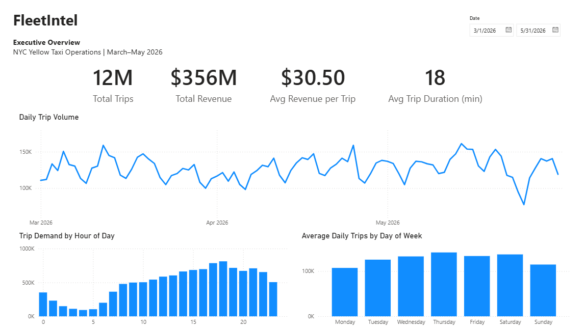
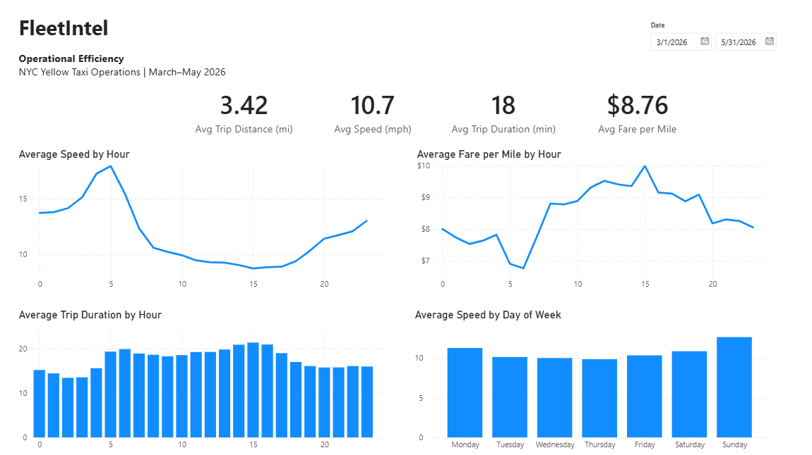
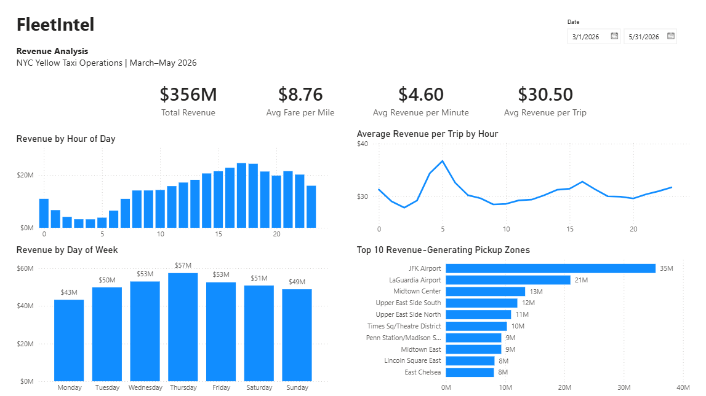

# FleetIntel

FleetIntel is a data analytics project based on NYC Yellow Taxi trip data from March to May 2026. The project covers the workflow from raw data validation and cleaning to Python analysis, SQL, and a Power BI dashboard.



## What I wanted to find out

- When is taxi demand highest?
- Where are most taxi trips starting?
- Which locations and routes are the busiest?
- How do trip speed and operational patterns change over time?
- Do the busiest periods and locations also generate the most revenue?

## Data

I used the official **NYC Taxi & Limousine Commission (TLC) Yellow Taxi Trip Records** for March, April, and May 2026.

The three monthly files contained **11,874,527 trips**. After cleaning, **11,718,495 trips** remained for analysis, or about **98.7% of the original data**.

The data includes pickup and drop-off times and locations, trip distance, passenger count, payment type, fares, tips, tolls, and surcharges.

The raw files are not included in this repository because of their size.

## How I worked with the data

I kept the workflow in separate Python scripts so that each step can be run and reviewed on its own:

1. **Exploration** – checked the structure, data types, missing values, and basic distributions.
2. **Validation** – investigated timestamps, trip duration, distance, passenger counts, financial values, and missing-data patterns.
3. **Cleaning** – removed invalid timestamps, unrealistic trip durations, and implausible trip speeds.
4. **Feature engineering** – created additional features for time, speed, fare efficiency, and tipping.
5. **EDA** – explored demand, trip characteristics, revenue, payment behavior, and operational patterns.
6. **SQL** – loaded the processed data into MySQL and used SQL for further analysis.
7. **Power BI** – brought the main results together in a four-page interactive dashboard.

With more than 11 million rows, repeatedly aggregating the full MySQL table became impractical for some analyses. I created smaller summary tables for location, route, and hourly/daily metrics and used them for the later SQL and Power BI work.

More detail about the validation, cleaning, feature engineering, and exploratory analysis is available in the [`docs`](docs/) folder.

## What I found

- **Demand is strongest later in the day.** Trip volume builds throughout the day and is highest in the late afternoon and early evening. Thursday had the highest average daily trip volume, while Monday was the quietest weekday.

- **Pickup activity is heavily concentrated in Manhattan.** Upper East Side South was the busiest pickup zone with about **540K trips**, followed closely by other Manhattan locations such as Midtown Center and Upper East Side North.

- **High trip volume does not always mean high revenue.** JFK Airport generated about **$35M**, making it the highest-revenue pickup zone even though several Manhattan zones handled more trips. This suggests that trip value and distance also matter when comparing locations.

- **Trip speeds change noticeably throughout the day.** Average speeds were lowest during the daytime and afternoon and highest in the early morning. Sunday had the highest average speed of the week.

- **The busiest hours are not necessarily the most valuable per trip.** The analyzed trips generated about **$356M**, averaging **$30.50 per trip**. Overall revenue increases as demand grows, but average revenue per trip was highest in the early morning.

## Power BI Dashboard

The final dashboard has four pages covering demand, location, operational performance, and revenue.

### Executive Overview


### Location & Zone Analysis


### Operational Efficiency



### Revenue Analysis



The Power BI file is available in:

```text
powerbi/FleetIntel_Dashboard.pbix
```

## Tools

**Python** · **Pandas** · **NumPy** · **PyArrow** · **Matplotlib** · **SQL** · **MySQL** · **SQLAlchemy** · **Power BI** · **Git/GitHub**

## Project Structure

```text
FleetIntel/
├── data/
│   ├── raw/
│   └── processed/
├── docs/
│   ├── 01_project_design.md
│   ├── 02_data_validation_report.md
│   ├── 03_data_cleaning_methodology.md
│   ├── 04_feature_engineering.md
│   └── 05_exploratory_data_analysis.md
├── powerbi/
│   └── FleetIntel_Dashboard.pbix
├── reports/
│   └── figures/
├── sql/
│   └── fleetintel_analysis.sql
├── src/
│   ├── 01_data_exploration.py
│   ├── 02_data_validation.py
│   ├── 03_data_cleaning.py
│   ├── 04_feature_engineering.py
│   ├── 05_exploratory_data_analysis.py
│   ├── 06_load_to_mysql.py
│   └── 07_create_sql_summaries.py
├── .env.example
├── .gitignore
├── README.md
└── requirements.txt
```

## Running the project

Install the required packages:

```bash
pip install -r requirements.txt
```

Download the Yellow Taxi Trip Records for **March, April, and May 2026** and the Taxi Zone Lookup file, and place them in:

```text
data/raw/
```

Run the Python scripts in order:

```bash
python src/01_data_exploration.py
python src/02_data_validation.py
python src/03_data_cleaning.py
python src/04_feature_engineering.py
python src/05_exploratory_data_analysis.py
```

For the MySQL part, copy `.env.example` to `.env` and add your own database credentials. Then run:

```bash
python src/06_load_to_mysql.py
python src/07_create_sql_summaries.py
```

The SQL analysis is available in `sql/fleetintel_analysis.sql`.

## Data Source

This project uses the official **NYC Taxi & Limousine Commission (TLC) Yellow Taxi Trip Records**.

**Official dataset:**  
https://www.nyc.gov/site/tlc/about/tlc-trip-record-data.page

The analysis uses Yellow Taxi trip records for **March, April, and May 2026**, together with the Taxi Zone Lookup file.

The original trip files are not stored in this repository because of their size and can be downloaded directly from the official TLC website.
